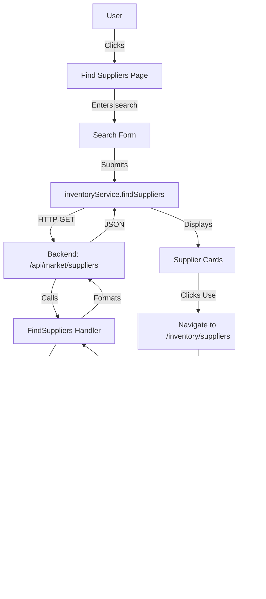

# Find Suppliers - Architecture Diagram

## System Architecture



## Component Flow

```
FindSuppliers.tsx (Page)
    │
    ├─→ Search Form
    │   ├─→ Product Input
    │   └─→ Location Input
    │
    ├─→ Results Grid
    │   ├─→ Supplier Card 1
    │   ├─→ Supplier Card 2
    │   └─→ Supplier Card N
    │
    └─→ Empty States
        ├─→ Initial State
        ├─→ Loading State
        └─→ No Results State
```

## Data Flow

```
1. User Input
   ├─→ searchQuery: "shirt"
   └─→ searchLocation: "Kathmandu"

2. Service Call
   └─→ inventoryService.findSuppliers("shirt", "Kathmandu")

3. Backend Processing
   ├─→ Validate JWT token
   ├─→ Extract query params
   ├─→ Call Serper API
   │   └─→ POST https://google.serper.dev/places
   │       └─→ {
   │             q: "shirt wholesale supplier",
   │             location: "Kathmandu",
   │             gl: "np"
   │           }
   └─→ Format response

4. Serper API Response
   └─→ {
         places: [
           {
             title: "ABC Clothing",
             address: "New Road, Kathmandu",
             phone: "+977-1-123456",
             website: "https://...",
             rating: 4.5,
             reviews: 128,
             type: "Clothing wholesaler",
             latitude: 27.7172,
             longitude: 85.3240
           }
         ]
       }

5. Frontend Display
   └─→ Maps to PlaceResult interface
   └─→ Renders supplier cards

6. User Action
   └─→ Clicks "Use This Supplier"
   └─→ Dispatches custom event
   └─→ Navigates to /inventory/suppliers

7. Form Pre-fill
   └─→ SupplierDialog listens for event
   └─→ Opens and switches to manual tab
   └─→ Fills form fields
   └─→ User adds email and submits

8. Database Save
   └─→ POST /api/suppliers/create
   └─→ Saved to suppliers table
```

## API Endpoints

```
┌─────────────────────────────────────────────────────────┐
│ Backend Endpoints                                       │
├─────────────────────────────────────────────────────────┤
│                                                         │
│  GET /api/market/suppliers                              │
│  ├─→ Query: q (required)                                │
│  ├─→ Query: location (optional, default: "Nepal")       │
│  ├─→ Auth: JWT required                                 │
│  └─→ Returns: Array of DiscoveredSupplier               │
│                                                         │
│  POST /api/suppliers/create                             │
│  ├─→ Body: { name, address, phone_number, email }       │
│  ├─→ Auth: JWT required                                 │
│  └─→ Returns: Created Supplier                          │
│                                                         │
└─────────────────────────────────────────────────────────┘
```

## File Structure

```
Store-management-system/
│
├── backend/
│   ├── handlers/
│   │   └── market.handler.go          ← FindSuppliers() function
│   ├── main.go                         ← Route registration
│   └── SUPPLIER_DISCOVERY.md           ← API documentation
│
├── frontend/
│   ├── src/
│   │   ├── pages/
│   │   │   └── FindSuppliers.tsx       ← NEW: Main page
│   │   ├── components/
│   │   │   ├── CreateInventoryDialogs.tsx  ← Modified: Pre-fill listener
│   │   │   └── InventorySidebarItem.tsx    ← Modified: Nav link
│   │   ├── services/
│   │   │   └── inventory.ts            ← Modified: findSuppliers()
│   │   └── App.tsx                     ← Modified: Route
│   │
│   └── FIND_SUPPLIERS_GUIDE.md         ← User guide
│
└── IMPLEMENTATION_SUMMARY.md           ← Complete summary
```

## State Management

```
FindSuppliers Component State:
├─→ searchQuery: string           // User's search term
├─→ searchLocation: string        // Location for search
├─→ searching: boolean            // Loading state
├─→ suppliers: DiscoveredSupplier[] // Results
└─→ hasSearched: boolean          // Track if search occurred

SupplierDialog Component State:
├─→ open: boolean                 // Dialog visibility
├─→ loading: boolean              // Submission loading
├─→ activeTab: string             // "discover" | "manual"
├─→ searchQuery: string           // Dialog search
├─→ searchLocation: string        // Dialog location
├─→ searching: boolean            // Dialog loading
└─→ discoveredSuppliers: Array    // Dialog results
```

## Event System

```
Custom Event: "prefill-supplier"

Dispatched By:
  └─→ FindSuppliers.tsx
      └─→ handleUseSupplier()
          └─→ window.dispatchEvent()

Listened By:
  └─→ CreateInventoryDialogs.tsx
      └─→ useEffect() listener
          └─→ handlePrefill()
              └─→ Opens dialog & fills form

Event Payload:
  └─→ DiscoveredSupplier {
        name, address, phone,
        website, rating, reviews,
        category, place_id,
        latitude, longitude
      }
```

## Security

```
┌─────────────────────────────────────────────┐
│ Security Measures                           │
├─────────────────────────────────────────────┤
│                                             │
│  1. JWT Authentication                      │
│     ├─→ All API calls require valid token   │
│     └─→ Token validated in middleware       │
│                                             │
│  2. API Key Protection                      │
│     ├─→ SERPER_API_KEY in backend only      │
│     └─→ Never exposed to frontend           │
│                                             │
│  3. Input Validation                        │
│     ├─→ Query parameters sanitized          │
│     └─→ Form inputs validated               │
│                                             │
│  4. Error Handling                          │
│     ├─→ No sensitive data in errors         │
│     └─→ User-friendly error messages        │
│                                             │
└─────────────────────────────────────────────┘
```

## Performance

```
Optimization Strategies:
├─→ Loading skeletons for better UX
├─→ Debounced search (user-controlled)
├─→ Efficient re-renders with React state
├─→ Responsive images (none used)
└─→ Minimal API calls (one per search)

Expected Performance:
├─→ Initial load: < 1s
├─→ Search response: 1-3s (Serper API)
├─→ Form pre-fill: < 200ms
└─→ Submission: < 1s
```

## Error Handling Flow

```
Search Error:
├─→ API call fails
├─→ Catch error in try/catch
├─→ Extract error message
├─→ Set error state
├─→ Show toast notification
└─→ Display empty state

No Results:
├─→ Empty array returned
├─→ Show "No suppliers found" card
├─→ Display helpful tips
└─→ Suggest alternative searches

Network Error:
├─→ Fetch fails
├─→ Show error toast
├─→ Log to console
└─→ Allow retry
```

## Mobile Responsiveness

```
Breakpoints:
├─→ Mobile (< 768px)
│   └─→ Single column layout
│   └─→ Stacked form inputs
│   └─→ Full-width cards
│
├─→ Tablet (768px - 1024px)
│   └─→ Two column grid
│   └─→ Side-by-side inputs
│
└─→ Desktop (> 1024px)
    └─→ Three column grid
    └─→ Optimized spacing
```

---

**Architecture**: Clean, simple, and maintainable
**Data Flow**: Unidirectional (React best practices)
**Security**: JWT + API key protection
**Performance**: Optimized for fast loading
